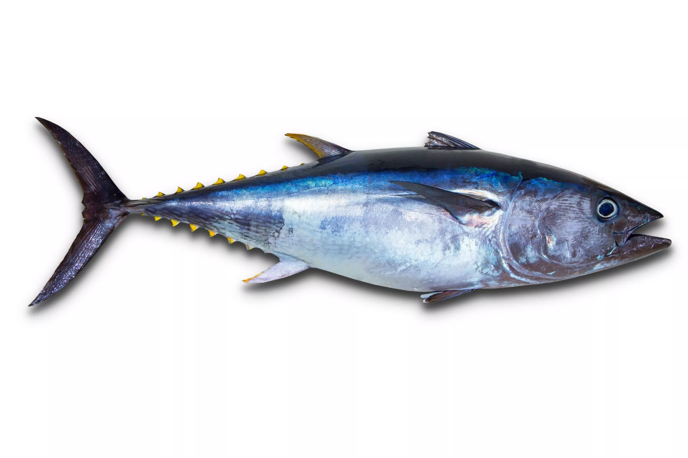
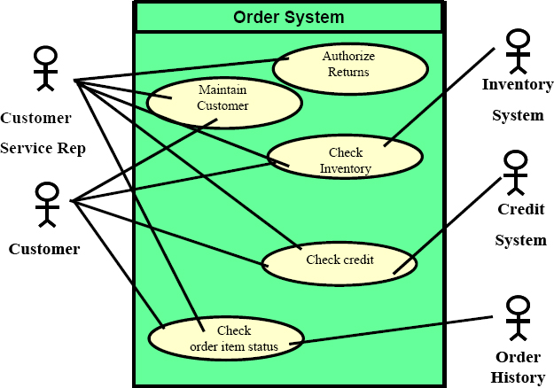

# Yellow Fin Tuna

#
### Framework

*  - [Drupal](https://www.drupal.org/)

### Order System
* Order system is the procedure for obtaining, monitoring, and completing consumer orders. When a consumer places an order, the order management process starts, and it finishes when they get their package.

### Sub System
* Order Capture

* Order Processing

* Inventory Processing

* Payment Processing

'
